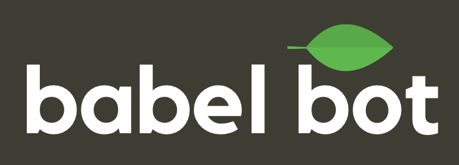

 
 
    
 

Babel-Bot
---
Transation bot for Drift.

<i>Note this project is no longer actively maintained.</i>

Requires a Google API key with access to the Google Cloud Transation service. You can create one from here: https://cloud.google.com/translate/.

You can find your Drift OAuth Access token by following the quick start <a href="https://devdocs.drift.com/docs/quick-start">here</a>.

Once you create the Drift app, you should set the `new_message` and `button_action` webhooks and point to your deployed Heroku (or other service) instance of the babel-bot server with endpoint `/api`.

## Deploying to Heroku

### CLI install 

1. `heroku create`

2. `git push heroku master`

3. `heroku addons:create heroku-postgresql:hobby-dev`

4. `heroku config:set BOT_API_TOKEN={OAuth Access token}`

5. `heroku config:set GOOGLE_API_KEY={Google Api Key}`

### GUI install

